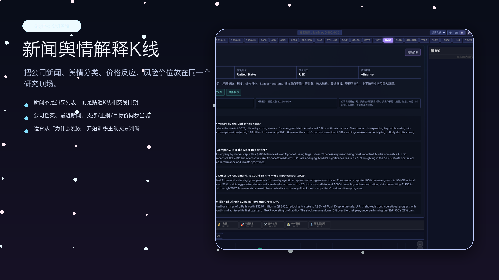
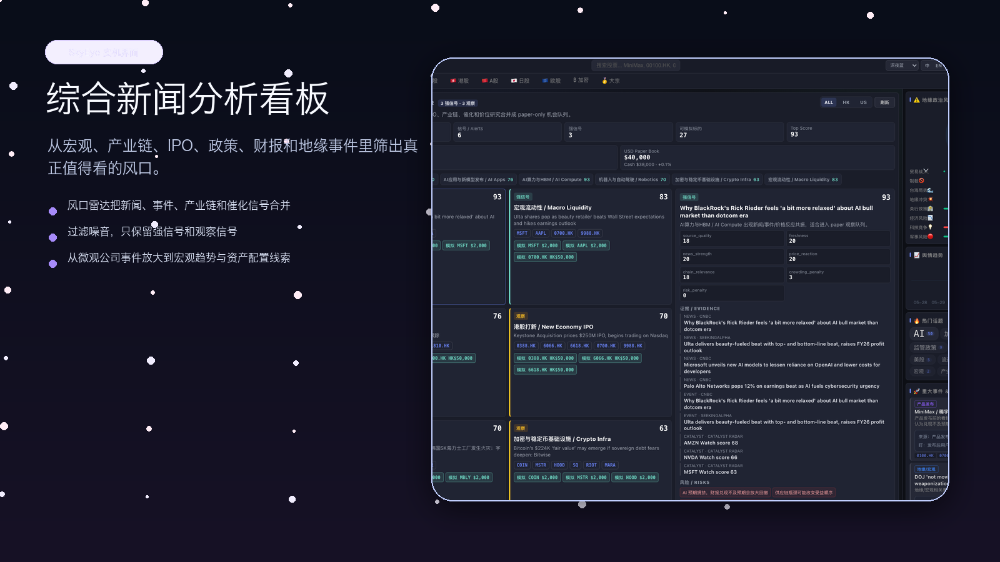
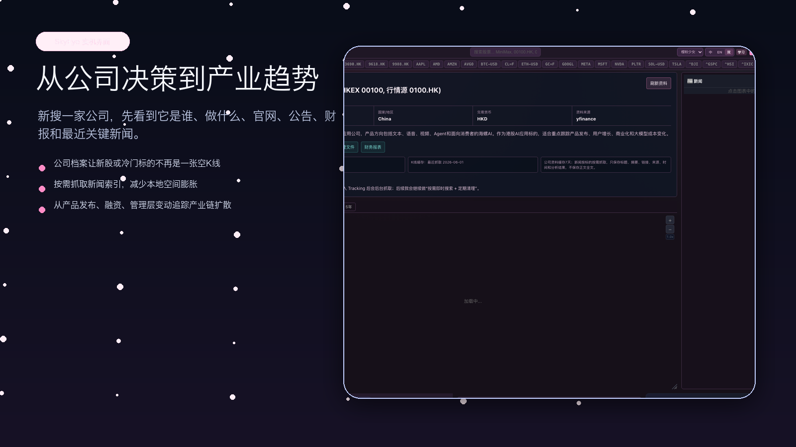

# SkyEye

SkyEye is a personal market-intelligence dashboard for learning-driven investing. It connects market narratives, company profiles, news, events, IPO watchlists, supply-chain themes, K-line context, and dual-currency paper trading.

> Research and paper trading only. SkyEye does not place live orders and does not provide financial advice.

## Product Preview







## 15-Second Launch Videos

- [Opportunity Radar](docs/media/01-opportunity-radar.mp4)
- [Company Profile](docs/media/02-company-profile.mp4)
- [Paper Trading](docs/media/03-paper-trading.mp4)

## Highlights

- Opportunity Radar: turns news, events, IPOs, catalyst data, and trade setups into research alerts.
- Company Profile: shows what a company does, website, filings, financial links, sector, industry, and recent local news index.
- Dual-currency paper books: HKD paper book for Hong Kong equities and USD paper book for US equities.
- News-to-price workflow: aligns news dates with OHLC data, K-line views, sentiment, and follow-up watch points.
- Theme system: deep terminal looks plus brighter themes such as Sakura, Daylight, and Aurora.

## Local Setup

```bash
python3 -m venv .venv
source .venv/bin/activate
pip install -r requirements.txt
pip install -r requirements-ml.txt

cd frontend
npm install
npm run build
cd ..

cp .env.example .env
python server.py
```

Open `http://localhost:8888`.

## Safety

- Local `.env`, SQLite databases, model artifacts, caches, and generated build assets are excluded from the public repository.
- Paper trading is simulation only.
- HKD and USD books are intentionally not FX-converted.
- News storage is designed around metadata and analysis indexes, not full article archives.
